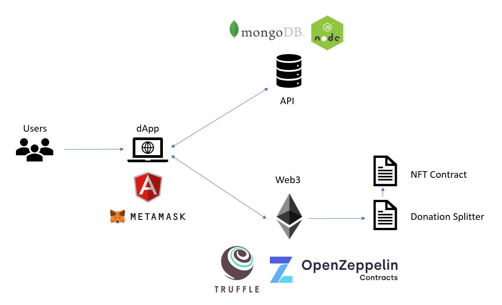

.. _ref-platform:

########
Platform
########

*The Fugue Foundation dApp and API are under active development*

****************
Project Overview
****************
.. index:: ! Decentralized Application
.. index:: ! Ethereum
.. index:: ! Application Programming Interface
.. index:: ! Non-fungible Token
.. index:: ! Effective Altruism

The Fugue Foundation manages a few open source projects, which combine together to create an Ethereum-based donation platform guided by the principles of effective altruism.

When a user visits the decentralized application (dApp), the page queries a dataset of nonprofit organizations through an application programming interface (API) and populates four selections. These are three groupings (plus one create-your-own option) of nonprofits based on the criteria of certain charity evaluator organizations such as Give Well, Charity Navigator, and Effective Altruism (see :ref:`ref-partnership`). The user then selects one of these options and sends ether or any ERC20 token to the dApp. Through the logic encoded in the Fugue Foundation smart contracts deployed the Ethereum blockchain, the donation is split among the chosen nonprofits and the user is rewarded with a non-fungible token (NFT). 

****
dApp
****

* Angular 9
* Truffle
* Open Zeppelin
* Solidity

The angular frontend and the smart contract backend are being developed separately for now. However, the angular dapp does have services providing a functional Truffle/Web3 integration, which will make combining the two later very simple.

For the frontend, the focus is on improving functionality, improving UX/UI (Angular Material), and writing tests (Karma, Jasmine, Protractor). The prototype is based off of the Angular `Tour of Heroes tutorial <https://angular.io/tutorial>`_ and the Web3 integration is based off a `Truffle Angular box <https://github.com/Quintor/angular-truffle-box>`_.

For the smart contract backend, it is `Truffle <https://www.trufflesuite.com/docs/truffle/overview>`_ compilation with modified `Open Zeppelin <https://docs.openzeppelin.com/contracts/2.x/>`_ contracts. Specifically, there is an `ERC721` contract and a `PaymentSplitter` contract that should work together, meaning that when a user should receive an NFT whenever they send funds to the splitter contract. So the focus here is building out a few of the methods to each contract to capture the functionality, and to write tests (in both Solidity and Javascript) to capture the intended behavior.

* *Angular Frontend*: https://github.com/fuguefoundation/ff-dapp 
* *Truffle Backend*: https://github.com/fuguefoundation/ff-contracts

***
API
***

* MongoDB
* Node.js
* Express
* Javascript

RESTful API running on Heroku in a dev environment. There is a working prototype, link will be provided to confirmed developers. There are two primary objects using GET, POST, PATCH, and DELETE requests. In the short term, the goal is to build out the API in a secure and efficient fashion. 

* *API repo*: https://github.com/fuguefoundation/ff-api
* See :ref:`ref-api`

*******************
Part-time Developer
*******************

*Description*: Seeking a part-time developer to help improve the dApp frontend (Angular), the backend (Web3, smart contracts), and/or the API (NodeJS, MongoDB). Give us a sense of your background, motivation, and skills that contribute to the project. If you are good fit, you can complete one of the bounties funded on Gitcoin. If we are both still interested in moving forward collaboratively after that, we can discuss other features and improvements to the project.

*Location*: Remote

*Start Date*: ASAP

*Tech*: Solidity, Web3, Javascript, Typescript, Angular, Truffle, Node, MongoDB, APIs

*Responsibilities*

- Work on development, testing and deployment of FF Smart Contracts.
- Assisting in the development of Front-End / Back-End which support FF Front-End Dapp.
- Design, build, and maintain APIs, services, and systems across FF engineering team.
- Improve engineering standards, tooling, and processes.

*Qualifications and Experience*:

- 1+ years experience writing robust Solidity Smart Contracts, Web3.JS, and Angular if working on the Dapp. If you want to work on the API, 3+ years experience with NodeJS and MongoDB.
- Proficiency with GitHub. All code is housed in repos on Github so changes will be submitted as pull requests.
- Software engineering experience in a production environment.
- A good understanding of the EVM architecture and crypto-economic protocol design including governance and incentive structures. Prior experience with building infrastructure for financial or security systems is a plus.
- A knack for finding flaws in solidity and can efficiently communicate how to fix them.
- Working knowledge of Heroku, IPFS is a plus.
- Strong written and verbal communication skills and can collaborate effectively on a breadth of technical topics.
- Doesn’t always default to industry norms when solving a problem.
- An ability to think like an attacker to develop threat models.

*Pricing*: Hourly or contractual, paid in ETH or DAI

*How To Apply*: See announcements on `Gitcoin <https://gitcoin.co/>`_ or look at the issues listed in the Github repos. Contact **info [at] fuguefoundation [.] org** with your information (see Description above) or for further clarifications.
